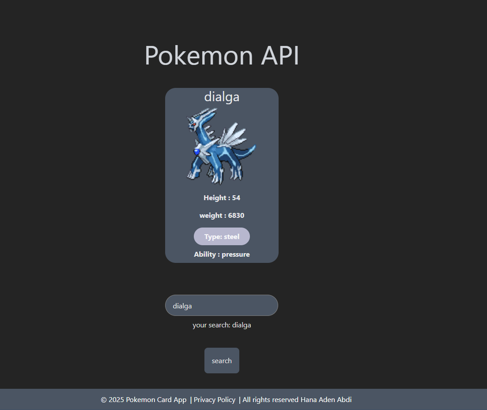

### **GitHub Repository**

* **Name:** `pokemon-viewer`
* **Description:** “React TypeScript app fetching Pokémon from PokeAPI with automatic updates every 2 seconds.”

---

### **README.md**

````markdown
# Pokemon Viewer

A simple **React TypeScript** app that fetches Pokémon from [PokeAPI](https://pokeapi.co/) and displays their **name** and **image**, updating automatically every 2 seconds.

## Live Demo
Check it out live: [Pokemon Card App](https://pokemon-card-app-one.vercel.app/)

## Features
- Fetches Pokémon data from PokeAPI
- Displays Pokémon name and image
- Automatically cycles through Pokémon every 2 seconds
- Built with React, TypeScript, and Tailwind CSS

## Installation
1. Clone the repository:
```bash
git clone https://github.com/YOUR_USERNAME/pokemon-viewer.git
````

2. Install dependencies:

```bash
npm install
```

3. Run the app:

```bash
npm run dev
```

## Technologies

* React
* TypeScript
* Tailwind CSS
* PokeAPI

## Screenshots




## Author

Hana Aden Abdi

```


